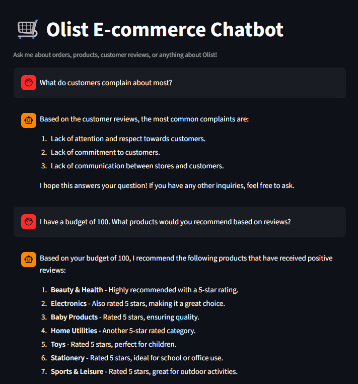

# Olist E-commerce Chatbot

An AI-powered customer service chatbot built on the [Olist Brazilian E-commerce Dataset](https://www.kaggle.com/datasets/olistbr/brazilian-ecommerce).  
This project demonstrates an iterative architectural evolution across three versions — from a basic LangChain pipeline, to a workflow-based LangGraph system, to a multi-agent architecture with multilingual support.

---

## Demo



> Streamlit-based chat interface running the v2 LangGraph workflow. Supports multi-turn conversation with SQL, RAG, Hybrid, and LLM fallback routing.

---

## Version History

| Version | Architecture | Key Features |
| --- | --- | --- |
| v1.0 LangChain | if-else Router + Chain | Baseline SQL + RAG pipeline |
| v2.0 LangGraph | Graph + Conditional Edges | Multi-turn Memory, SQL retry, Token management, Streamlit UI, REST API |
| v3.0 Multi-Agent | LangGraph + Autonomous Agents + Language Detection + Translation | Agent-based execution, multilingual input/output, unified translation layer |
| v3.1 Performance | Wide Table + Metadata Filtering + Reject Node | SQL latency -48%, Hybrid latency -53%, out-of-scope response -87% |

---

## Project Goal

The goal of this project is to build a customer-support-style assistant that can answer different types of e-commerce questions through different reasoning paths:

- **SQL path** for structured questions such as counts, rankings, and statistics
- **RAG path** for semantic questions over customer reviews
- **Hybrid path** for questions requiring both structured filtering and review-based evidence
- **LLM path** for general conversation and out-of-scope requests

Instead of forcing all questions into one pipeline, the system routes each query to the most suitable path.

---

## Architecture

### v3.1 — Performance Optimization (Latest)

v3.1 builds on v3.0 with targeted optimizations driven by a 25-case benchmark evaluation using LangSmith tracing.

**Key changes:**

- **Wide table (`customer_shopping_info`)** — flattened view covering orders, customers, items, products, payments, reviews, and sellers. Reduces multi-table join overhead for most SQL queries.
- **`schema_tool`** — on-demand raw schema access, only invoked for complex queries that need it.
- **FAISS metadata filtering** — RAG retrieval now filters by `customer_state`, `product_category_name`, `review_score`, and `payment_type` before similarity search, reducing noise.
- **`reject_answer_node`** — out-of-scope questions handled by direct string output without calling the LLM, cutting response time from 7–13s to ~1.2s.
- **`lingua` language detection** — replaces LLM-based detection in the translation node; only triggers translation when input and output language differ.
- **SQL logic fixes** — corrected date-difference calculations, deduplication rules, and category-level sales aggregation.

**Performance results (25-case benchmark):**

| Path | Before | After | Change |
| --- | --- | --- | --- |
| SQL (avg) | 8.3s | 4.3s | **-48%** |
| Hybrid (avg) | 22.0s | 10.3s | **-53%** |
| LLM in-scope | 7.1s | 2.5s | **-65%** |
| LLM out-of-scope | 9.2s | 1.2s | **-87%** |
| RAG (avg) | 7.2s | 5.9s | -18% |

Router accuracy: **25/25 (100%)** on the benchmark set.

---

### v3.0 — Multi-Agent with Language Support

v3 upgrades each graph node from fixed workflow logic to an **autonomous Agent**, and adds a dedicated **language detection + translation layer** so the system can handle multilingual input and return answers in the user's original language.

```text
User Input
    ↓
language_detection_node  (detect user's language)
    ↓
router_node              (LLM classifies intent)
    ↓
┌─────────────┬──────────────┬────────────────┬────────────┐
│  sql_agent  │  rag_agent   │ hybrid_agent   │  llm_agent │
│  SQL query  │ FAISS search │ SQL → RAG      │ General QA │
│  + retry    │  + summary   │ combined answer│            │
└─────────────┴──────────────┴────────────────┴────────────┘
    ↓
translation_node         (translate back to user's language)
    ↓
Final Answer
```

**4-path routing system**

- **SQL path** — structured queries such as order counts, sales statistics, and product rankings
- **RAG path** — semantic search over customer reviews using FAISS
- **Hybrid path** — SQL results combined with RAG-based semantic evidence for richer answers
- **LLM path** — general conversation and unsupported questions

**Key ideas in v3.0**

- `language_detection_node`: detects user language (English, Chinese, Spanish, etc.) and stores it in state
- `sql_agent`: generates SQL, executes via tool, and retries on failure using prompt feedback
- `rag_agent`: retrieves and summarizes review evidence
- `hybrid_agent`: combines SQL filtering with RAG-based semantic evidence
- `llm_agent`: lightweight fallback for general questions
- `translation_node`: unified post-processing step that translates the final answer back into the user's original language

**Why centralize translation?**  
Earlier versions required each prompt to handle language formatting manually, which was hard to maintain and inconsistent. v3 moves language handling into a dedicated node, so agents focus on reasoning while one place owns output language.

### v2.0 — LangGraph Workflow


The v2 version uses a fixed-logic LangGraph workflow with conditional edges.

Main flow:

1. Route the user question
2. Run SQL / RAG / LLM based on intent
3. For hybrid questions, run SQL first and then pass SQL results into the RAG step
4. Retry SQL up to 3 times if execution fails
5. Return a summarized answer

This is the most complete **deployable** version in the repository because it includes:

- **Streamlit UI**
- **FastAPI REST API**
- **MemorySaver-based multi-turn memory**
- **Full evaluation results**

---

## Evaluation

The project includes two evaluation sets — a comprehensive one for v2 and a focused quick-check for v3.

### v2 Full Evaluation (20 cases)

| Metric | Score |
| --- | --- |
| **Strict Accuracy** | **65.0%** |
| **Lenient Success Rate** | **90.0%** |

**Per-path breakdown:**

| Path | Strict Accuracy | Lenient Success Rate |
| --- | --- | --- |
| SQL | 100% | 100% |
| LLM Fallback | 100% | 100% |
| RAG | 40% | 100% |
| Hybrid | 40% | 80% |
| Memory Follow-up | 50% | 50% |

**Key observations:**

- **SQL** was the most reliable path — all structured queries returned correct results
- **RAG** retrieved relevant content consistently, but summarization quality was sometimes too generic
- **Hybrid** was the most sensitive to prompt design — complex price + review combinations were less stable
- **LLM fallback** handled greetings and out-of-scope questions correctly in all cases
- **Memory** worked well in short, explicit follow-ups but degraded in longer multi-turn conversations

### v3 Quick Evaluation (8 cases)

A focused check covering core paths plus the two new v3 capabilities (multilingual input and agentized execution).

| Category | Cases | Result |
| --- | --- | --- |
| SQL | 2 | Both correct |
| RAG | 1 | Correct |
| Hybrid | 2 | 1 correct, 1 partial |
| Memory Follow-up | 1 | Correct |
| Language Following (Chinese, Spanish) | 2 | Both correct |

**v3 notes:**

- Agent-style execution worked and language-following behavior improved after adding the translation node
- Overall answer quality is comparable to v2 — the main difference is execution style and flexibility, not dramatic accuracy gains
- v3 is treated as an agentized extension of the same system rather than a fully stronger replacement

Files: `evaluation_v2.ipynb`, `evaluation_v2.csv`, `quick_eval_v3.ipynb`, `evaluation_v3.csv`

---

### v3.1 Benchmark Evaluation (25 cases)

Full benchmark run using LangSmith tracing, covering all routing paths and multilingual inputs.

| Category | Cases | Route Accuracy | Notes |
| --- | --- | --- | --- |
| SQL | 5 | 5/5 | Major logic fixes: date calculation, deduplication, aggregation |
| RAG | 5 | 5/5 | Answer quality improved with metadata filtering |
| Hybrid | 5 | 5/5 | Serial SQL→RAG flow stable; latency reduced by 53% |
| LLM in-scope | 3 | 3/3 | Scoped to Olist business context |
| LLM out-of-scope | 3 | 3/3 | Handled by reject node, no LLM call needed |
| Multilingual (CN/PT/Mixed) | 4 | 4/4 | lingua-based detection, output language consistent |

Overall router accuracy: **25/25 (100%)**

Files: `bench_work.xlsx`, `develop_result.xlsx`

---

## Key Features

- **4-path routing** — SQL, RAG, Hybrid, and LLM fallback
- **Multilingual Support (v3)** — language detection at entry and translation at exit
- **Multi-turn Memory** — conversation history preserved across turns using LangGraph `MemorySaver` + `thread_id`
- **Hybrid Retrieval** — SQL structured results combined with FAISS semantic search
- **SQL Error Retry** — SQL path retries up to 3 times with error feedback when execution fails
- **Token Optimization** — SQL results truncated and RAG results limited to reduce context overflow
- **Graceful Fallback** — general questions handled by the LLM path
- **REST API** — FastAPI backend exposing the chatbot as an HTTP endpoint with thread-based memory
- **Streamlit UI** — browser-based chat interface for live demonstration
- **Evaluation** — manual evaluation for both v2 (full) and v3 (quick) with query-type breakdown

---

## Tech Stack

| Category | Tools |
| --- | --- |
| Agent / Workflow Framework | LangGraph, LangChain |
| Language Model | OpenAI GPT-4o-mini |
| Vector Store | FAISS |
| Database | SQLite + LangChain SQLDatabase |
| API | FastAPI + Uvicorn |
| UI | Streamlit |
| Development | Python, Jupyter Notebook, Cursor |

---

## Project Structure

```text
olist-chatbot/
├── agent.py              # v2.0 Streamlit chatbot (LangGraph workflow)
├── agent.ipynb           # v2.0 notebook version
├── multi_agent.ipynb     # v3.0 multi-agent with language support
├── multi_agent_v3.1.ipynb # v3.1 performance-optimized version
├── api_agent.py          # FastAPI REST API version
├── app.py                # v1.0 original LangChain baseline
├── evaluation_v2.ipynb   # v2 full evaluation notebook
├── evaluation_v2.csv     # v2 evaluation results (20 cases)
├── quick_eval_v3.ipynb   # v3 quick evaluation notebook
├── evaluation_v3.csv     # v3 evaluation results (8 cases)
├── bench_work.xlsx        # v3.1 benchmark baseline (25 cases, LangSmith traced)
├── develop_result.xlsx    # v3.1 before/after performance comparison
├── faiss_db/             # FAISS vector index (40K+ review embeddings)
├── olist.db              # SQLite database
├── architecture.png      # v2 architecture diagram
├── demo.png              # Streamlit UI screenshot
├── .env                  # API keys (not included)
└── README.md
```

---

## How to Run

### 1. Clone the repo

```bash
git clone https://github.com/linhuifan1-gif/olist-chatbot.git
cd olist-chatbot
```

### 2. Install dependencies

```bash
pip install langchain langgraph langchain-openai langchain-community faiss-cpu python-dotenv streamlit fastapi uvicorn
```

### 3. Prepare the data

This repo does not include the database or vector index because the files are too large for GitHub. You need to generate them yourself:

1. Download the [Olist Brazilian E-commerce Dataset](https://www.kaggle.com/datasets/olistbr/brazilian-ecommerce) from Kaggle (9 CSV files)
2. Load the CSV files into a SQLite database named `olist.db` in the project root, with one table per CSV (e.g. `orders`, `customers`, `items`, `products`, `sellers`, `payments`, `reviews`, `geolocation`, `category_translation`)
3. Build the FAISS vector index from the review data and save it as `faiss_db/` using OpenAI Embeddings

> Note: The resulting FAISS index is around 250MB and contains 40K+ review embeddings. The notebook cells that build these files are preserved in earlier project versions for reference.

### 4. Set up environment

Create a `.env` file in the project root:

```env
OPENAI_API_KEY=your_key_here
OPENAI_BASE_URL=your_base_url_here
```

### 5. Run the project

**Option 1: Streamlit UI (v2 workflow)**

```bash
streamlit run agent.py
```

**Option 2: FastAPI REST API**

```bash
uvicorn api_agent:app --reload
```

Then open: `http://127.0.0.1:8000/docs`

**Option 3: Multi-Agent notebook (v3)**

Open  (latest) or  (v3.0)`multi_agent.ipynb`

**Option 4: Evaluation notebooks**

Open  (latest) or  (v3.0)`evaluation_v2.ipynb` or `quick_eval_v3.ipynb`

---

## Architecture Comparison

| Feature | v1.0 LangChain | v2.0 LangGraph | v3.0 Multi-Agent |
| --- | --- | --- | --- |
| Multi-turn Memory | ❌ | ✅ | ✅ |
| SQL Error Retry | ❌ | ✅ hardcoded | ✅ autonomous |
| Token Management | ❌ | ✅ | ✅ |
| Graph Visualization | ❌ | ✅ | ✅ |
| REST API | ❌ | ✅ | ❌ |
| Routing | if-else | Conditional edges | LLM + Conditional edges |
| Node Logic | Fixed functions | Fixed functions | Autonomous Agents |
| Retry Logic | None | Hardcoded counter | LLM self-managed |
| Language Detection | ❌ | ❌ | ✅ |
| Multilingual Output | ❌ | ❌ | ✅ |
| Wide Table / Schema Tool | ❌ | ❌ | ✅ (v3.1) |
| Metadata Filtering (RAG) | ❌ | ❌ | ✅ (v3.1) |
| Out-of-scope Reject Node | ❌ | ❌ | ✅ (v3.1) |
| Benchmark Evaluation | ❌ | ✅ 20 cases | ✅ 25 cases (LangSmith) |

---

## Dataset

[Olist Brazilian E-commerce Dataset](https://www.kaggle.com/datasets/olistbr/brazilian-ecommerce) — 100K+ orders, multiple relational tables, and customer reviews in Portuguese.

This dataset makes it possible to test:

- Structured SQL-style e-commerce analysis
- Review-based semantic retrieval
- Hybrid customer-support scenarios

---

## Notes and Limitations

- The project focuses on **application-layer AI system design**, not model training
- Hybrid questions are more sensitive to prompt design than pure SQL or RAG questions
- Memory works best in short, explicit follow-up scenarios
- v3.0 mainly explores more autonomous execution and multilingual handling within the same routing architecture
- v3.1 focuses on performance optimization and accuracy improvement through wide table design, metadata filtering, and prompt engineering — not a structural change

---

## About

Built as an AI application / agent workflow project demonstrating the evolution from a baseline LangChain pipeline to a LangGraph workflow system to a multi-agent architecture with multilingual support, using a real-world e-commerce dataset.
