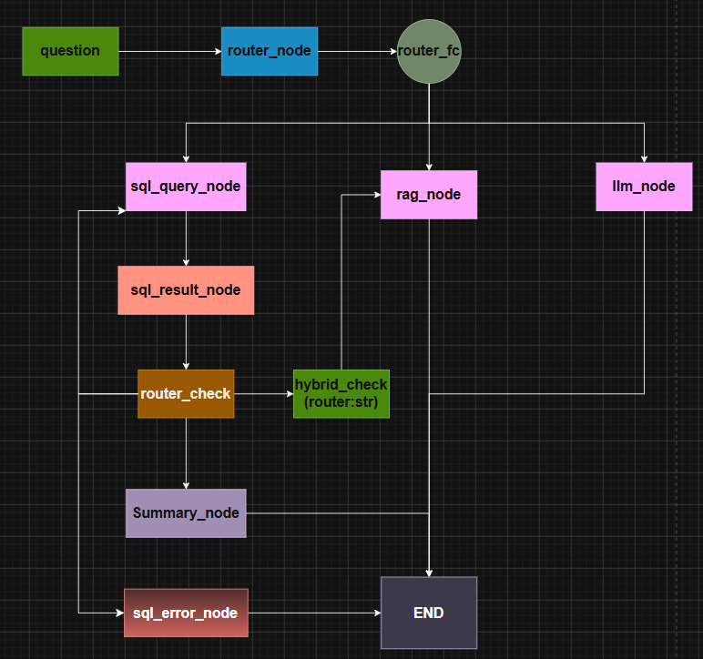

# Olist E-commerce Chatbot — LangGraph Version

An AI-powered customer service chatbot built on the [Olist Brazilian E-commerce Dataset](https://www.kaggle.com/datasets/olistbr/brazilian-ecommerce). This version refactors the original LangChain implementation using **LangGraph**, introducing multi-turn memory, intelligent routing, SQL error retry logic, and token-optimized context management.

---

## Architecture



The chatbot uses a **4-path routing system**:

- **SQL path** — structured queries (order counts, sales statistics, product rankings)
- **RAG path** — retrieves customer reviews using FAISS vector search
- **Hybrid path** — combines SQL results + RAG for recommendation questions (e.g. "What's a good gift under 100 reais with good reviews?")
- **LLM path** — handles general conversation and out-of-scope questions

---

## Key Features

- **Multi-turn Memory** — conversation history preserved across turns using LangGraph `MemorySaver`
- **SQL Error Retry** — automatically retries up to 3 times with error feedback when SQL execution fails
- **Hybrid Routing** — single `router:str` state field controls routing across the entire graph
- **Token Optimization** — intermediate results cleared after each turn to prevent context overflow
- **Graceful Fallback** — friendly error messages when questions cannot be answered

---

## Tech Stack

- **LangGraph** — graph-based workflow orchestration
- **LangChain** — prompt templates, chains, output parsers
- **OpenAI GPT-4o-mini** — language model
- **FAISS** — vector store for customer review retrieval
- **SQLite + LangChain SQLDatabase** — structured data queries
- **Python** — pandas, dotenv
- **Cursor** — AI-assisted development

---

## Project Structure

```
olist-chatbot/
├── agent.ipynb        # Main chatbot (LangGraph version)
├── faiss_db/          # FAISS vector index
├── olist.db           # SQLite database
├── .env               # API keys (not included)
└── README.md
```

---

## How to Run

1. Clone the repo and switch to the `langgraph-version` branch:
```bash
git clone https://github.com/linhuifan1-gif/olist-chatbot.git
cd olist-chatbot
git checkout langgraph-version
```

2. Install dependencies:
```bash
pip install langchain langgraph langchain-openai langchain-community faiss-cpu python-dotenv
```

3. Create a `.env` file with your API key:
```
OPENAI_API_KEY=your_key_here
OPENAI_BASE_URL=your_base_url_here
```

4. Open `agent.ipynb` and run all cells.

---

## Comparison: LangChain vs LangGraph Version

| Feature | LangChain (main) | LangGraph (this branch) |
|---|---|---|
| Multi-turn Memory | ❌ | ✅ |
| SQL Error Retry | ❌ | ✅ (up to 3x) |
| Token Management | ❌ | ✅ |
| Graph Visualization | ❌ | ✅ |
| Routing | if-else | Conditional edges |

---

## Dataset

[Olist Brazilian E-commerce Dataset](https://www.kaggle.com/datasets/olistbr/brazilian-ecommerce) — 100K+ orders, 9 tables, customer reviews in Portuguese.
